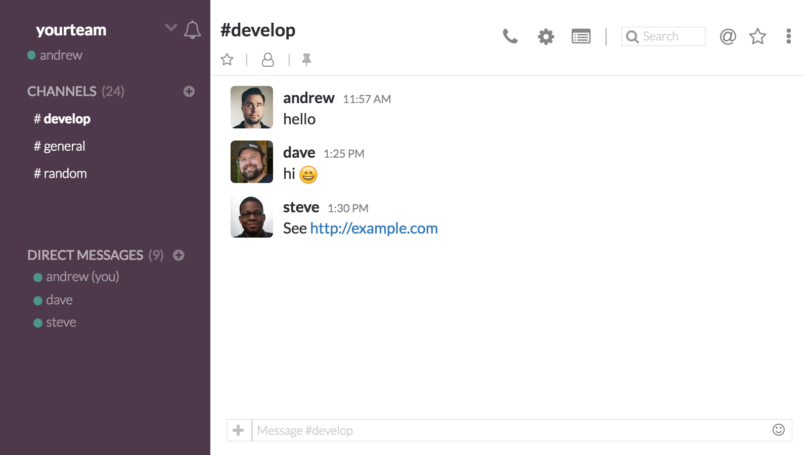

# smog-prototype - slack mock generator (prototype)

メンバ名や発言を定義したyamlファイルからslack風の画像を生成します



上記の画像を下記のyamlファイルを定義するだけで作成できます

```
teamname: yourteam
yourname: andrew
channel_num: 24
channels:
  - develop
  - general
  - random
current_channel: 1
dm_num: 9
dmusers:
  - andrew (you)
  - dave
  - steve
messages:
  - name: andrew
    date: 11:57 AM
    text: foo
    icon: https://randomuser.me/api/portraits/men/41.jpg
  - name: dave
    date: 1:25 PM
    text: bar
    icon: https://randomuser.me/api/portraits/men/99.jpg
  - name: steve
    date: 1:30 PM
    text: baz
    icon: https://randomuser.me/api/portraits/men/91.jpg
```

また、事前にslackteamのユーザ情報をエクスポートしておくことで、各ユーザのアイコン画像URLの指定が不要になります

## 使い方

__パッケージのインストール__

```
$ npm install
```

__slackユーザ情報のエクスポート (任意)__

事前にslackteamのユーザ情報をエクスポートしておくことで、各ユーザのアイコン画像URLの指定が不要になります

```
$ export token="your-slack-test-token"
$ npm run export
```

slackのテストトークンはここから取得できます [https://api.slack.com/docs/oauth-test-tokens](https://api.slack.com/docs/oauth-test-tokens)

個別にユーザ画像URLをyamlファイルに指定する場合には、この工程の作業は不要です

__yamlファイルの準備__

`data.yml` をお好みで編集します

__ローカルサーバの起動とキャプチャの取得__

```
$ npm start
```

slack風のモック画面をローカルサーバとして起動して、画面キャプチャを取得します。

キャプチャした画像は `slackmock.png` という名前で保存されます

`data.yml` を編集すると、自動で画面キャプチャを取得しなおします

## 参考

- slack風画面は [Slack Chat CSS | #codevember](https://codepen.io/mikemang/pen/YpNYWV) を参考に作成しました
- サンプルのユーザアイコンには [RANDOM USER GENERATOR](https://randomuser.me/) の画像を利用しています
